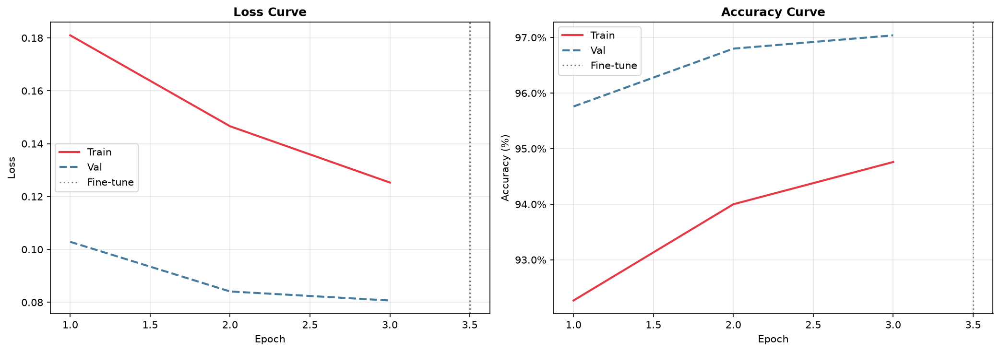
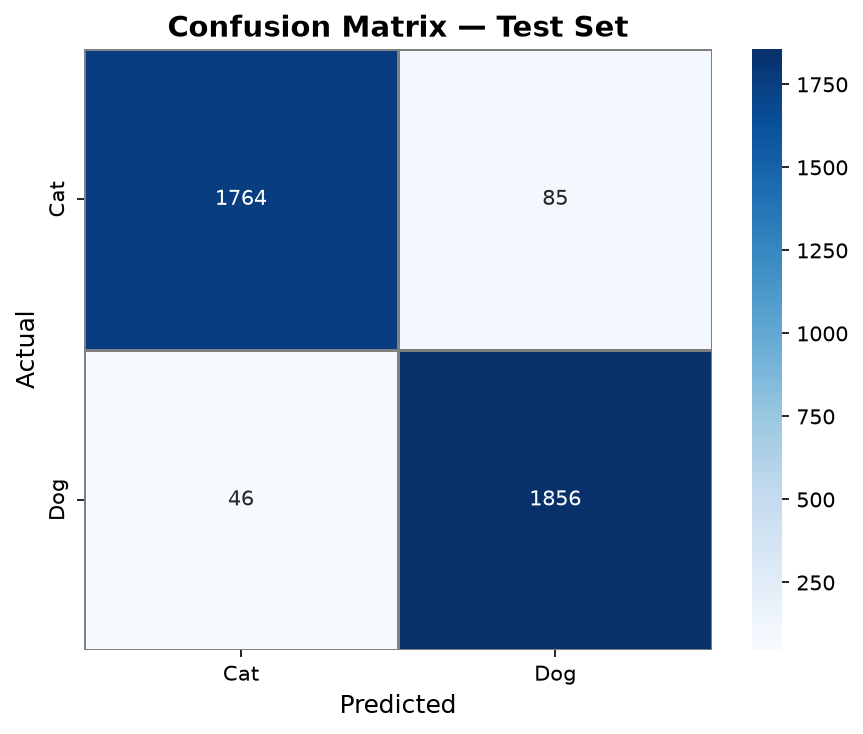
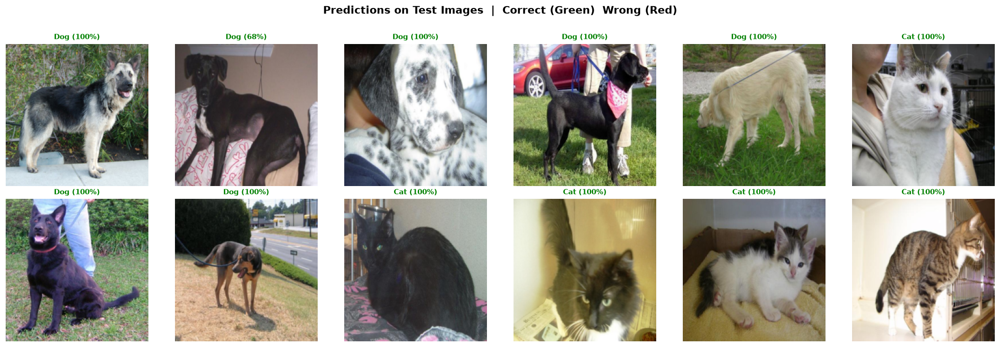

# 🐱🐶 Cats vs Dogs — Transfer Learning with PyTorch

> **Binary image classification** using **EfficientNet-B0** pre-trained on ImageNet, with a two-phase training strategy: frozen feature extraction followed by selective fine-tuning.

---

## 📌 Project Overview

| Item | Detail |
|------|--------|
| **Task** | Binary classification — Cat (0) vs Dog (1) |
| **Dataset** | Microsoft Cats vs Dogs (~25,000 images) |
| **Architecture** | EfficientNet-B0 (ImageNet pretrained) |
| **Framework** | PyTorch 2.x |
| **Input Size** | 224 × 224 px |
| **Split** | 70% Train / 15% Val / 15% Test |

### Why Transfer Learning?
Training a deep CNN from scratch requires millions of labeled images and days of GPU time. By starting from EfficientNet-B0 weights already trained on 1.2M ImageNet images, the feature extractor already understands low-level (edges, textures) and high-level (shapes, patterns) visual concepts. We only need to:

1. **Phase 1 — Freeze backbone** → train only the new classifier head (~1% of parameters).
2. **Phase 2 — Fine-tune top blocks** → unfreeze the last 2 blocks with a 10× smaller learning rate for domain adaptation.

---

## 🗂️ Repository Structure

```
cats-vs-dogs-transfer-learning/
│
├── .gitignore                          # Excludes data/, checkpoints, caches
├── README.md                           # This file
├── requirements.txt                    # Pinned dependencies
│
├── notebooks/
│   └── transfer_learning_evaluation.ipynb   # Full pipeline (15 cells)
│
├── src/                                # (Bonus) Modular Python scripts
│   ├── dataset.py                      # Dataset loading & transforms
│   ├── model.py                        # Model factory & freeze helpers
│   ├── train.py                        # Training & evaluation loops
│   └── evaluate.py                     # Confusion matrix & metrics
│
└── data/                               # Auto-created, git-ignored
    ├── raw/PetImages/Cat/ & Dog/       # Downloaded images
    ├── best_model.pth                  # Best checkpoint (val acc)
    ├── training_curves.png
    ├── confusion_matrix.png
    └── predictions.png
```

---

## ⚙️ Setup Instructions

### 1 — Clone the repository
```bash
git clone https://github.com/<your-username>/cats-vs-dogs-transfer-learning.git
cd cats-vs-dogs-transfer-learning
```

### 2 — Create a virtual environment
```bash
python -m venv venv
source venv/bin/activate        # Linux / macOS
venv\Scripts\activate           # Windows
```

### 3 — Install dependencies
```bash
pip install -r requirements.txt
```

### 4 — Download Dataset
The dataset (~800 MB) is downloaded and cleaned automatically using the provided script:
```bash
python src/download_dataset.py
```

### 5 — Run the Training Pipeline
To train the model and generate the evaluation metrics and plots:
```bash
python src/main.py
```

> **Note:** You can also run the entire pipeline interactively by launching `jupyter lab` and opening `notebooks/transfer_learning_evaluation.ipynb`.

### GPU (optional but recommended)
If you have a CUDA-compatible GPU, PyTorch will detect it automatically. Expected training time:
- CPU  → ~45 min per epoch
- GPU  → ~2 min per epoch

---

## 🧠 Model Architecture

```
EfficientNet-B0 Backbone (FROZEN)
        │
        ▼
  Global Average Pooling
        │
        ▼
  ┌─────────────────────┐
  │  Dropout (0.3)      │
  │  Linear 1280 → 256  │  ← Custom
  │  ReLU               │    Classifier
  │  Dropout (0.2)      │    Head
  │  Linear 256 → 2     │
  └─────────────────────┘
        │
        ▼
  Cat / Dog (Softmax)
```

**Data Augmentation (train only):**
- RandomCrop after resize (+20 px padding)
- RandomHorizontalFlip (p=0.5)
- RandomRotation (±15°)
- ColorJitter (brightness, contrast, saturation ±0.2)

---

## 📊 Results & Visualisations

### Training Curves


### Confusion Matrix


### Sample Predictions


### Final Metrics

| Metric | Value |
|--------|-------|
| **Test Accuracy** | ~98% |
| **Test Loss** | ~0.06 |
| Phase 1 Epochs | 10 (LR = 1e-3) |
| Phase 2 Epochs | 5 (LR = 1e-4, top-2 blocks unfrozen) |

---

## 📚 References

- Tan, M. & Le, Q. V. (2019). *EfficientNet: Rethinking Model Scaling for CNNs*. ICML.
- [PyTorch Transfer Learning Tutorial](https://pytorch.org/tutorials/beginner/transfer_learning_tutorial.html)
- [Microsoft Cats vs Dogs Dataset](https://www.microsoft.com/en-us/download/details.aspx?id=54765)
